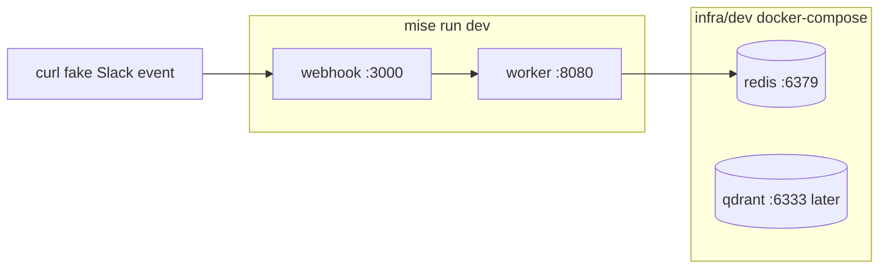
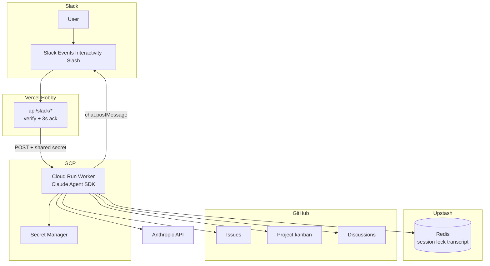
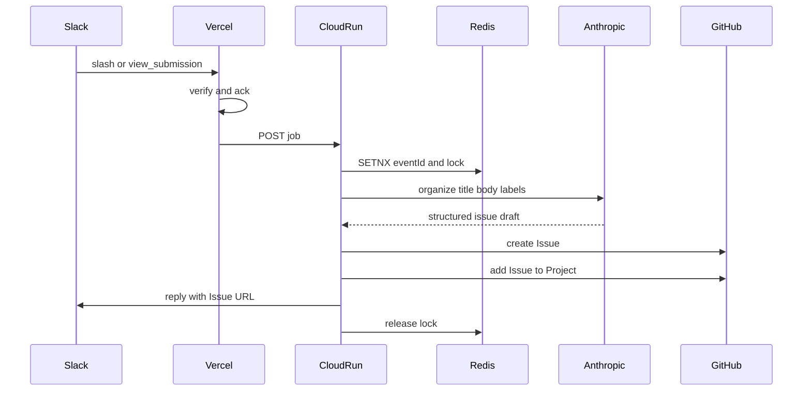
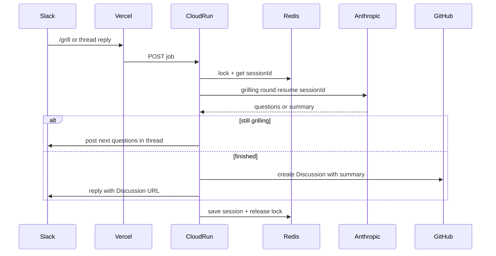
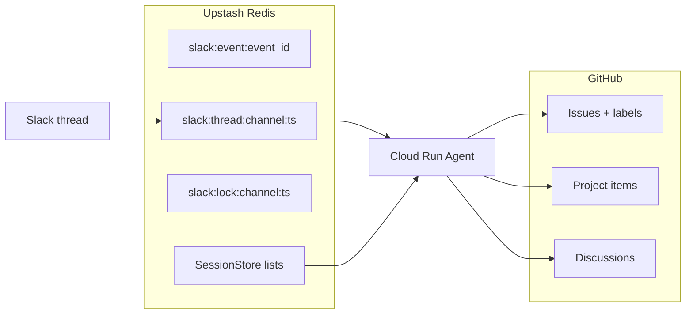

# アーキテクチャ

完成の線は [completion.md](completion.md)。このページは **v1 の実行時構成** と、後続の wiki をどこに足すかを示す。

## 何をするシステムか

Slack の slash から:

- **報告系**（`/bug` / `/feature` / `/refactor` / `/nfr`）→ AI が整理 → GitHub **Issue** → **Project** に追加
- **grilling**（`/grill`）→ スレッド往復 → 要約を **Discussion** に保存
- 素の `@bot` → ヘルプのみ

## インフラ構成

Vercel Hobby（Slack 入口）+ Cloud Run（Agent）+ Upstash Redis。Upstash Vector は **wiki RAG 後続用**（Terraform / ローカル Qdrant は用意済みだが v1 では使わない）。

- **Vercel**: 署名検証と 3 秒 ack（Events / slash / interactivity）
- **Cloud Run**: Claude Agent SDK、GitHub API、Slack 返信
- **Upstash Redis**: スレッド↔session、transcript、lock、重複排除
- **Secret Manager**: `ANTHROPIC_API_KEY`、Slack token、GitHub PAT、Worker 秘密

本番の GCP / Upstash は Terraform（[infra/prd](../infra/prd/README.md)）。Vercel は Terraform 対象外で、apply 後の `worker_url` を渡す。

ローカルはホストでアプリ、Docker で Redis（と後続用 Qdrant）。起動は [infra/dev/README.md](../infra/dev/README.md)。

| 本番 | ローカル |
|---|---|
| Vercel Hobby | ホスト `webhook` :3000（`--watch`） |
| Cloud Run | ホスト `worker` :8080（`--watch`） |
| Upstash Redis | Docker `redis` :6379 |
| Upstash Vector（後続） | Docker `qdrant` :6333 |
| Secret Manager | `infra/dev/.env` |

## 全体構成

## 報告系（Issue + Project）

`/bug` はモーダル、他は「コマンド＋ AI 向け指示文」。どちらも Worker 上の Agent が本文を整え、Issue 作成後に Project へ追加する。

## grilling（Discussion）

`/grill` でスレッドを開始し、frontier 質問 → 返信 → 次ラウンドを Redis session で継続。終了宣言で要約を Discussion に残す。

## データ置き場

環境変数（名前は実装時に確定）で `GITHUB_DEFAULT_REPO`・Project id・Discussion 用リポ／カテゴリを渡す。値は完成時点で未定でもよい。

## 後続: Wiki RAG

別リポの GitHub Wiki を Embed し、Vector 検索して回答に載せる。チャンネル名でのリポ切替も後続。v1 のコマンド契約には含めない。詳細な完成条件は [completion.md](completion.md) の「完成に入れないもの」。
