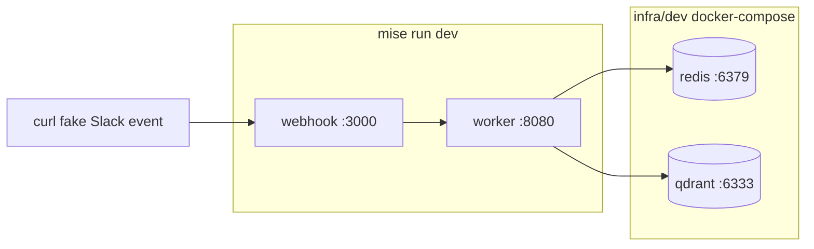
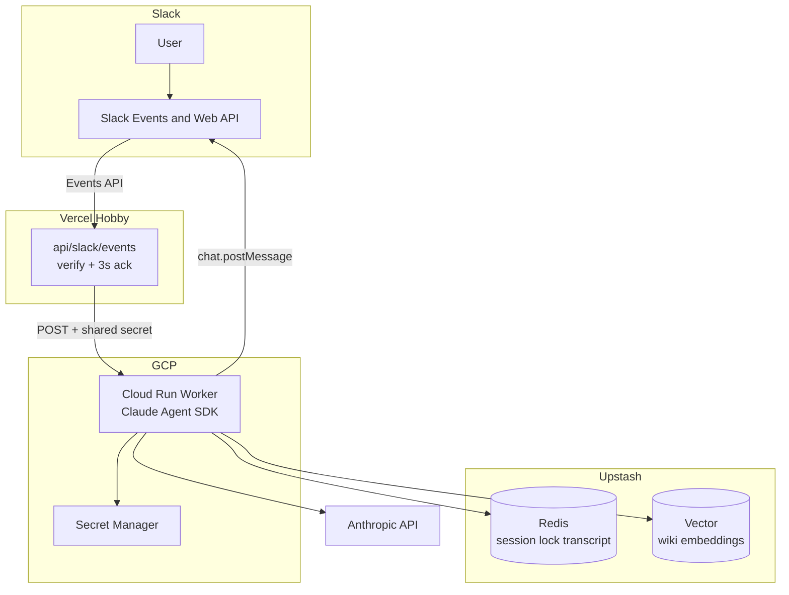
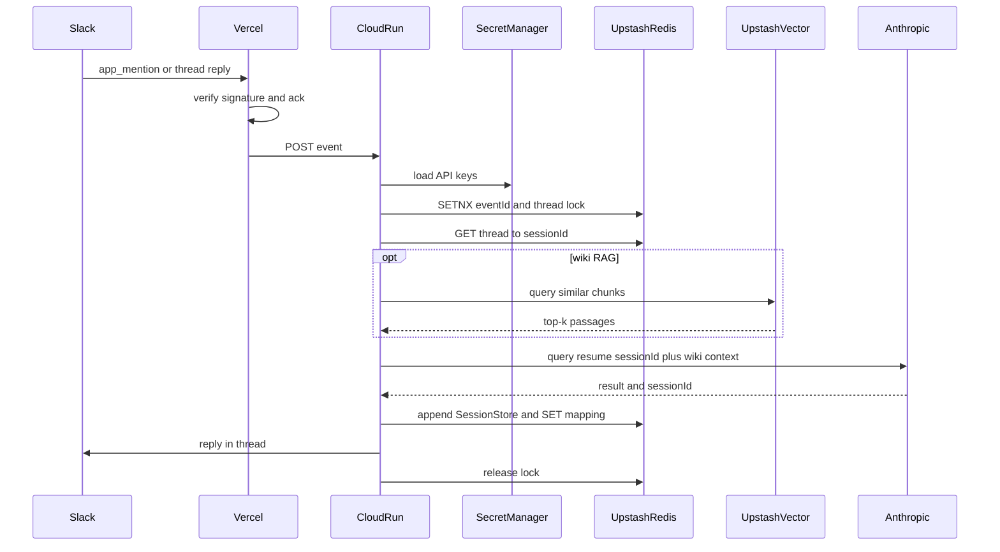
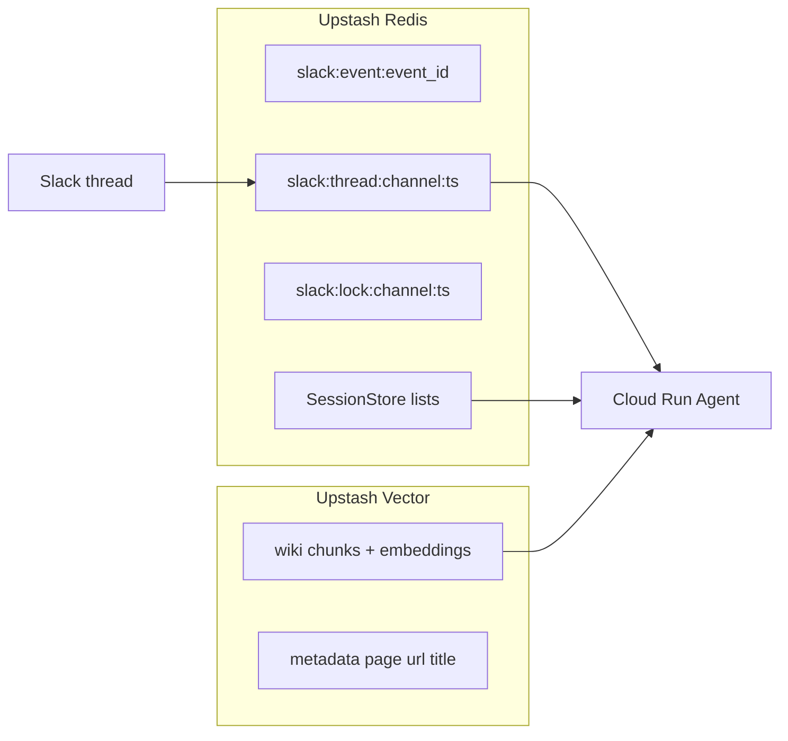

# インフラ構成

Vercel Hobby（Slack 入口）+ Cloud Run（Agent）+ Upstash Redis / Vector。

- **Vercel**: Slack Events の署名検証と 3 秒 ack だけ
- **Cloud Run**: Claude Agent SDK、wiki 検索、Slack 返信
- **Upstash Redis**: スレッドと session id、transcript、lock、重複排除
- **Upstash Vector**: wiki の意味検索（後から足してもよい）
- **Secret Manager**: `ANTHROPIC_API_KEY`、Slack token、Worker 秘密

本番の GCP / Upstash は Terraform（[infra/prd](../infra/prd/README.md)）。Vercel の webhook は Terraform 対象外で、apply 後の `worker_url` を Vercel に渡す。

ローカル再現はホストでアプリ、Docker で Redis / Qdrant。起動方法は [infra/dev/README.md](../infra/dev/README.md)。

| 本番 | ローカル |
|---|---|
| Vercel Hobby | ホスト `webhook` :3000（`--watch`） |
| Cloud Run | ホスト `worker` :8080（`--watch`） |
| Upstash Redis | Docker `redis` :6379 |
| Upstash Vector | Docker `qdrant` :6333 |
| Secret Manager | `infra/dev/.env` |

## 全体構成

## Slack 1通の流れ

## データ置き場

