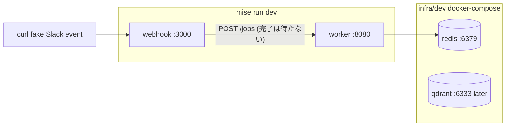
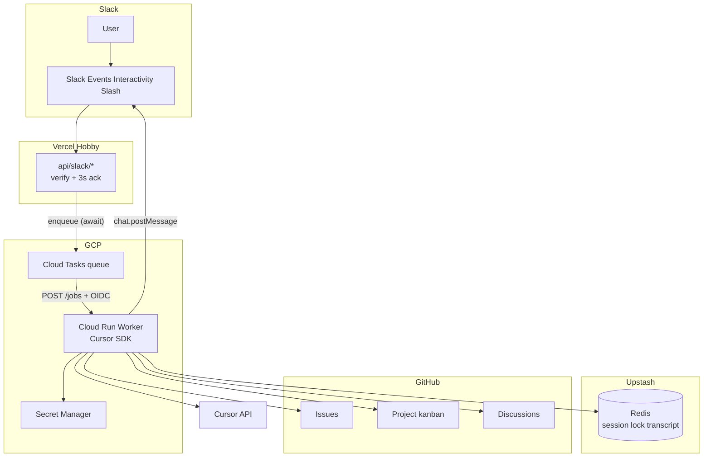
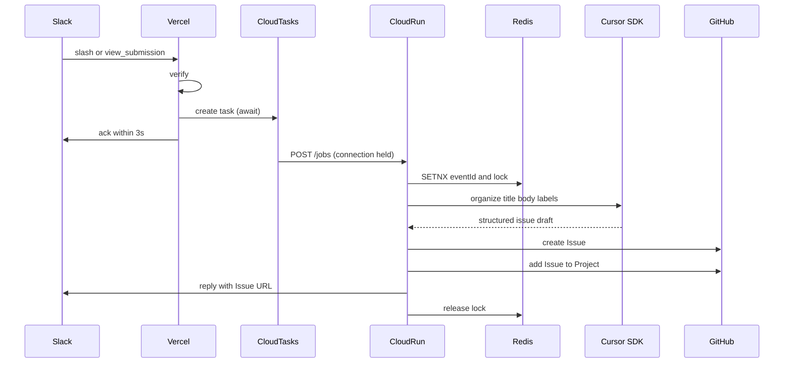
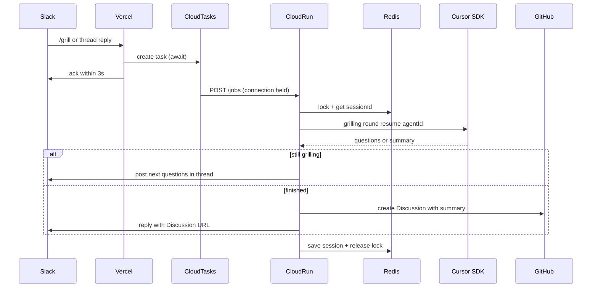
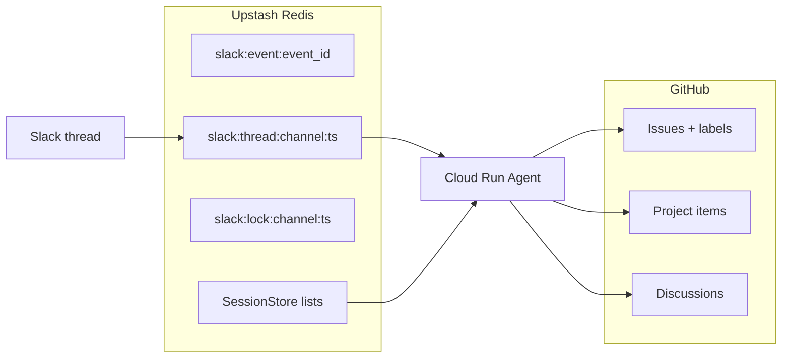

# アーキテクチャ

完成の線は [completion.md](completion.md)。このページは **v1 の実行時構成** と、後続の wiki をどこに足すかを示す。

## 何をするシステムか

Slack の slash から:

- **報告系**（`/bug` / `/feature` / `/refactor` / `/nfr`）→ AI が整理 → GitHub **Issue** → **Project** に追加
- **grilling**（`/grill`）→ スレッド往復 → 要約を **Discussion** に保存
- 素の `@bot` → ヘルプのみ

## インフラ構成

Vercel Hobby（Slack 入口）+ Cloud Run（Agent）+ Upstash Redis。Upstash Vector は **wiki RAG 後続用**（Terraform / ローカル Qdrant は用意済みだが v1 では使わない）。

- **Vercel**: 署名検証と 3 秒 ack（Events / slash / interactivity）。ack 前に Cloud Tasks へ enqueue
- **Cloud Tasks**: `POST /jobs` を Cloud Run へ配送し、リクエスト中は接続を維持する
- **Cloud Run**: Cursor SDK、GitHub API、Slack 返信
- **Upstash Redis**: スレッド↔session、transcript、lock、重複排除
- **Secret Manager**: `CURSOR_API_KEY`、Slack token、GitHub PAT、Worker 秘密、enqueue 用 SA キー

本番の GCP / Upstash は Terraform（[infra/prd](../infra/prd/README.md)）。Vercel は Terraform 対象外で、apply 後の `worker_url` と Cloud Tasks の出力を渡す。

ローカルはホストでアプリ、Docker で Redis（と後続用 Qdrant）。起動は [infra/dev/README.md](../infra/dev/README.md)。本番の Vercel isolate は Slack ack 後に freeze するため、Cloud Run へ直接 `fetch` してはいけない。

## Cloud Tasks の制約

- HTTP task の **dispatch deadline は最大約 30 分**（実装は 1800 秒）。それを超える Agent はこの経路の対象外。超えるなら別 issue で Cloud Run Jobs を検討する
- 失敗時のリトライはキューの `retry_config`（最大 5 回、backoff 10s〜300s、全体 3600s）。Cloud Tasks は HTTP **429 / 5xx** と接続失敗をリトライする。**4xx**（401 の秘密違い、400 の不正ジョブ）はリトライしない
- Worker の `POST /jobs` はリクエストを開けたまま処理する。クライアントは Vercel ではなく Cloud Tasks
- 同一 Slack `event_id` の再 enqueue は Cloud Tasks 上で ALREADY_EXISTS とし、成功扱い（Slack の再送に耐える）

| 本番 | ローカル |
|---|---|
| Vercel Hobby | ホスト `webhook` :3000（`--watch`） |
| Cloud Tasks | なし（`WORKER_URL` へ HTTP。完了は待たない） |
| Cloud Run | ホスト `worker` :8080（`--watch`） |
| Upstash Redis | Docker `redis` :6379 |
| Upstash Vector（後続） | Docker `qdrant` :6333 |
| Secret Manager | `infra/dev/.env` |

## 全体構成

## 報告系（Issue + Project）

`/bug` はモーダル、他は「コマンド＋ AI 向け指示文」。どちらも Worker 上の Agent が本文を整え、Issue 作成後に Project へ追加する。

## grilling（Discussion）

`/grill` でスレッドを開始し、frontier 質問 → 返信 → 次ラウンドを Redis session で継続。終了宣言で要約を Discussion に残す。

## データ置き場

環境変数でデフォルトを渡す。値は完成時点で未定でもよい。

| 変数 | 内容 |
|---|---|
| `GITHUB_PAT` | fine-grained PAT（Secret Manager / `infra/dev/.env`） |
| `GITHUB_DEFAULT_REPO` | Issue のデフォルト `owner/repo` |
| `GITHUB_PROJECT_ID` | Project v2 の node id（`PVT_...`） |
| `GITHUB_DISCUSSION_CATEGORY_ID` | Discussion カテゴリの node id（`DIC_...`） |
| `GITHUB_DISCUSSION_REPO` | Discussion 用 `owner/repo`。省略時は `GITHUB_DEFAULT_REPO` |

## 後続: Wiki RAG

別リポの GitHub Wiki を Embed し、Vector 検索して回答に載せる。チャンネル名でのリポ切替も後続。v1 のコマンド契約には含めない。詳細な完成条件は [completion.md](completion.md) の「完成に入れないもの」。
